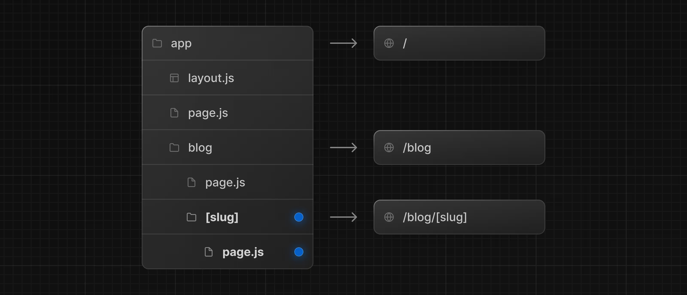
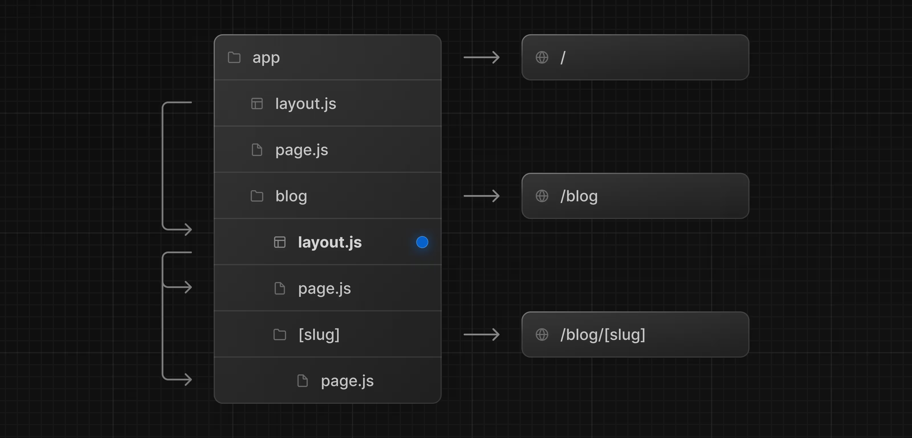

# Routing(1)

## Layout and Templates

- Next는 파일 기반 라우팅을 사용하고 있음
- 폴더와 파일을 사용하여 라우팅(경로) 정의 가능

### 페이지 만들기

- 페이지를 생성하기 위해선 `app`디렉토리 안에 `page.tsx`를 만들면 생성
  - 아래 사진은 `/`디렉토리에 페이지를 만드는 경우인데, 다른 디렉토리에 만들고 싶은 경우 원하는 이름의 폴더를 생성하고 `page.tsx`를 적용하면 해당 경로로 페이지가 생성된다.
    

### 레이아웃 만들기

- 레이아웃은 여러 페이지 간에 공유되는 UI
  - 레이아웃은 고정된 상태로 페이지(컴포넌트)만 교체됨
- `layout.tsx`에서 컴포넌트를 내보내서 레이아웃을 정의함
  - 레이아웃은 페이지의 레이아웃이 될 수 있게 children props를 받아야 함
    

```typescript
// 이 예시 코드는 앱 디렉토리의 루트에 정의되어 있음 -> 루트 레이아웃
// 루트 레이아웃은 필수이고 html와 body 태그가 지정되어야 함
export default function DashboardLayout({
  children,
}: {
  children: React.ReactNode;
}) {
  return (
    <html lang="en">
      <body>
        {/* Layout UI */}
        {/* Place children where you want to render a page or nested layout */}
        <main>{children}</main>
      </body>
    </html>
  );
}
```

### 중첩 라우팅 만들기

- 중첩 라우팅은 여러 URL 세그먼트로 구성된 경로임
- 예를 들어 `/blog/[slug]`는 /(루트 세트먼트) blog(세그먼트) [slug](리프 세그먼트) 세 가지로 구성됨
- NextJS에서 폴더는 URL 세그먼트에 매핑되는 경로 세그먼트를 정의하는 데 사용
- 폴더 안에 폴더를 두어 중첩 라우팅을 정의할 수 있음
  

- 만약 특정 블로그에 대한 경로(동적)를 만들고 싶다면 대괄호 [] 를 이용해 페이지 파일을 추가하면 사용 가능함
  

```typescript
// /blog/[slug]
export default function Page(({
  params,
}: {
    //아래와 같이 정의해서 slug 사용가능
  params: Promise<{ slug: string }>
})) {
    const { slug } = await params
  return <h1>Hello, Blog Post Page!</h1>;
}
```

### 중첩 레이아웃

- 레이아웃도 서로 중첩하여 레이아웃에 레이아웃을 감쌀 수 있음
- 원하는 폴더(라우트)에 `layout.tsx`를 추가하여 적용가능
  

```typescript
export default function BlogLayout({
  children,
}: {
  children: React.ReactNode;
}) {
  return <section>{children}</section>;
}
```

### 페이지 간 연결하기

- `<Link>`태그를 사용하면 페이지간 이동을 할 수 있음
  - HTML의 `a`태그를 확장
  - 프리페칭과 클라이언트 탐색 기능을 제공
- href를 통해 다른 페이지를 연결할 수 있음

```typescript
import Link from "next/link";

export default async function Post({ post }) {
  const posts = await getPosts();

  return (
    <ul>
      {posts.map((post) => (
        <li key={post.slug}>
          <Link href={`/blog/${post.slug}`}>{post.title}</Link>
        </li>
      ))}
    </ul>
  );
}
```

- Link 컴포넌트 이외에도 useRouter를 사용해 페이지간 이동을 조절할 수 있음
